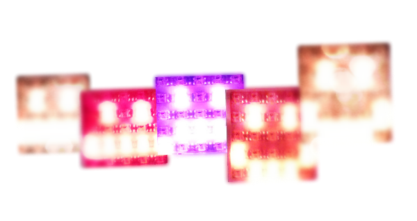
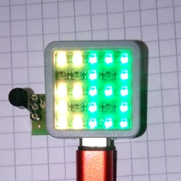

# M5atom matrix library

A simple micropython library to support 5x5 rgb led matrix in M5Atom Matrix.  The library allows you to set or delete individual pixels and set a group of pixels in one color using a "mask/pixmap".  It also contains a function for the so-called flash of a single pixel and the breathing effect for a single pixel. You can also display scrolling text on your matrix.

The library uses the HSV color model to simplify the implementation of the breathing effect function and support for limiting the brightness of LEDs in the matrix (due to the emission of a large amount of heat at full brightness).  The color is selected from the range 0-360.  It is also easy in this color model to get a smooth transition through all the colors of the rainbow by increasing the value of the variable color.

Folder [/lib](/lib) contains the main library file [**matrix.py**](/lib/matrix.py) responsible for handling the embedded rbg led matrix.  In addition, there is the helper library [**digits.py**](/lib/digits.py) containing pixmap data for numbers.There is also the [**dallas.py**](/lib/dallas.py) library used in the sample application.

Simple examples of using this library can be found in the example.py files

## Sample application

Simple thermometer application [**termo.py**](termo.py) using the dallas DS18B20 temperature sensor.  The program displays the temperature in two-digit form.  Due to the size of the led matrix (5x5) I did not implement the display of negative temperatures and greater than 99. I meant to show how you can display two digits at once on such a small display.  In this program, the second digit overlaps the first one covering its part.  The file [**example5.py**](example5.py) shows how to display the common part of overlapping digits in a different color.

To simplify the sensor connection, I used three outputs located next to the ground in the connector.  I used one of the inputs on the connector as a sensor 3.3V power supply pin.

I did not use the 5V pin to power the sensor because of pulling the output from it to this voltage and it was given to the esp input.  Various sources say that the esp gpio inputs tolerate 5V.  I prefer not to risk.

connection diagram:


showing 28 degrees




## Scrolling text example

Example script [adafruit.py](adafruit.py) displaying scrolling text with values from adafruit.io feeds. In this case to simplify acces to adafruit.io REST API was used. In this example at time when i wrote this, my feeds are updatet every 25 seconds. I do not guarantee that the feeds will be corect and current at later time.

running example:

```
#load example to memory (run once)
import adafruit

#run this function which read actual values from adafruit.io feeds
adafruit.read()
```

Watch example video on youtube:

[](https://youtu.be/D3xJCUcndfc)
